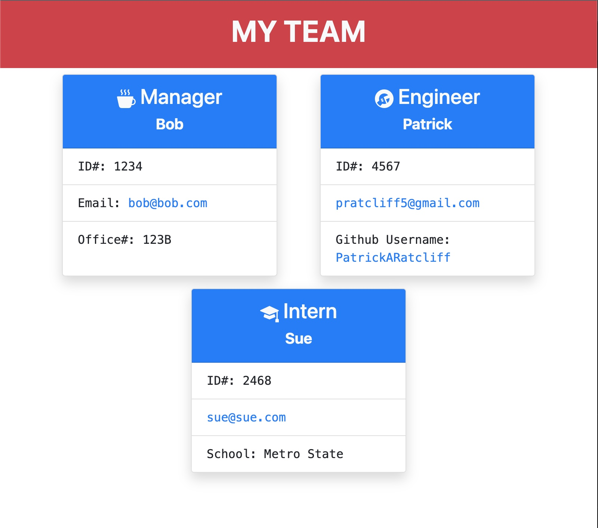

# m10c-team_profile_generator 
# 
# Date: 18/09/2022, 7:21:42 pm
# Github Username: PatrickARatcliff
# Github Repo URL: https://github.com/PatrickARatcliff/m10c-team_profile_generator

# Link to demo video: 
  
## Table of Contents
- [Project Description](#project-description)
- [Installation Instructions](#installation-instructions)
- [Usage Information](#usage-information)
- [Contribution Guidelines](#contribution-guidelines)
- [Test Instructions](#test-instructions)
- [License](#license)
  
## Project Description
- Using node command prompts from the terminal/bash , the user can generate a homepage (html) for their project team. The file will contain a title, cards for each employee. Each card will have the employee’s name, id#, email, and one other job related category. For managers:office#, engineers:github-username, interns:school. On the home page the emails will open a new window with an outgoing message via users default email provider, the GitHub username will open a new tab directed to the engineer's GitHub page.
  
## Installation Instructions
- This application requires "bootstrap-icons": "^1.9.1" and "email-validator": "^2.0.4" and "inquirer v8.2.4". As devDependencies it will require "jest": "^26.5.2" Simply copy the root directory from the repo and run "npm i" command from your integrated terminal. You should see the node modules directory populate under the repo used for the integrated terminal.
  
## Usage Information
- To use, simply open m10c-team_profile_generator directory with the integrated terminal/bash. type the command "nom run start". Through the terminal you will be prompted to enter information to create your team. The final prompt will ask "What would you like to do next?", simply use the up/down arrow keys to select your preference or select "Finish building Team" to create homepage. When the process is successfully completed you should see message "An html file has been created for your project!".
  
## Contribution Guidelines
- To contribute to this project, fork the repository at ‘https://github.com/PatrickARatcliff/m10c-team_profile_generator', create a pull request with a description for the change and its location.
  
## Test Instructions
- This includes a "jest" test suite for each class of team-member. Using your terminal/bash enter "npm run test".
    
## License
- MIT License
- m10c-team_profile_generator : Dynamically create a team homepage (html) for your team!.
- Copyright (c) [2022] [Patrick Ratcliff]. All rights reserved.

    

      Permission is hereby granted, free of charge, to any person obtaining a copy
      of this software and associated documentation files (the "Software"), to deal
      in the Software without restriction, including without limitation the rights
      to use, copy, modify, merge, publish, distribute, sublicense, and/or sell
      copies of the Software, and to permit persons to whom the Software is
      furnished to do so, subject to the following conditions:

      The above copyright notice and this permission notice shall be included in all
      copies or substantial portions of the Software.

      THE SOFTWARE IS PROVIDED "AS IS", WITHOUT WARRANTY OF ANY KIND, EXPRESS OR
      IMPLIED, INCLUDING BUT NOT LIMITED TO THE WARRANTIES OF MERCHANTABILITY,
      FITNESS FOR A PARTICULAR PURPOSE AND NONINFRINGEMENT. IN NO EVENT SHALL THE
      AUTHORS OR COPYRIGHT HOLDERS BE LIABLE FOR ANY CLAIM, DAMAGES OR OTHER
      LIABILITY, WHETHER IN AN ACTION OF CONTRACT, TORT OR OTHERWISE, ARISING FROM,
      OUT OF OR IN CONNECTION WITH THE SOFTWARE OR THE USE OR OTHER DEALINGS IN THE
      SOFTWARE.

    
***[This is an external link to the MIT license](https://en.wikipedia.org/wiki/MIT_License)***
  
---
